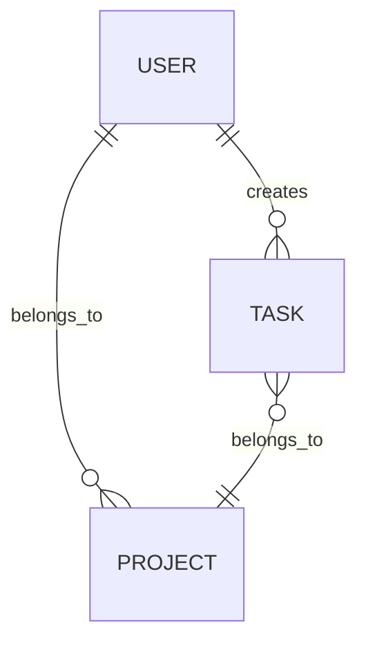

# AI要件レビュー・整合性検証サービス（SpecForge Review）

## Context

SYNQAIがNotebookLMのスライド枚数制限を突破し、API経由で最大56枚のスライドを自動生成するサービスを構築した事例に着想を得ている。同様のアプローチで、**人間が作成した要件定義ドキュメントを、AIマルチエージェントシステムで添削・整合性チェック・改善提案する**レビュープラットフォームを構築する。

**基本原則**:

- 要件定義の原文は必ず人間が作成する。AIは添削・質問・改善提案のみを行い、要件の最終決定は行わない。
- 人間の承認がない限り、次工程（設計展開・見積・コード生成）には進めない。
- 全てのレビューフローはGitHub PR駆動で実行される。

**解決する課題**: 非技術者（営業、企画、経営者）がソフトウェア開発を外注・発注する際、要件定義の抜け漏れ・曖昧さ・矛盾が開発着手後に発覚し、手戻りや予算超過が発生する。本サービスはGitHub上で管理される要件ドキュメントに対し、AIによる多角的レビューと整合性チェックを行い、品質を担保する。

**技術的挑戦**: Claude Codeのサブエージェント・スキル・MCP・ルールをフル活用したマルチエージェントレビューシステムの構築。最大10個の専門レビューエージェントが並列で動作し、人間作成の要件ドキュメントを多角的に検証する。GitHub連携により、PR駆動のレビューフローを実現する。

---

## アーキテクチャ概要

```
[人間] ── 要件作成 ──→ [GitHub リポジトリ]
                              │
                         Push / PR作成
                              │
                    ┌─────────▼─────────┐
                    │  GitHub Actions    │
                    │  (トリガー)         │
                    └─────────┬─────────┘
                              │
                    ┌─────────▼─────────┐
                    │  SpecForge Review  │
                    │  Orchestrator      │
                    │  (Claude Agent SDK)│
                    └─────────┬─────────┘
                              │
       ┌──────────────────────┼──────────────────────┐
       │                      │                      │
   Step 1: 人間作成      Step 2: AIレビュー      Step 3: 修正・承認
   (PR作成)              (並列エージェント)       (PRマージ)
       │                 ┌────┴────┐                 │
       ▼                 │ Review  │                 ▼
   requirements/         │ Agent   │             Step 4:
   *.md を               ▼ ×N     ▼             承認済み要件
   ブランチへPush      PRコメント/Check Run     エクスポート
```

> **用語区別**: 上図の **Step 1〜4** は1回のレビューサイクルにおける処理パイプラインを指す。後述の **Phase 1〜4** はプロジェクト実装ロードマップを指す。

### 処理ステップ定義

| Step | 名称 | 主体 | 内容 |
| ---- | ---- | ---- | ---- |
| Step 1 | Human Draft | 人間 | 要件ドキュメントを作成し、`feat/requirements-*` ブランチでPRを作成 |
| Step 2 | AI Review | AI（並列） | PRトリガーでレビューエージェントが並列実行。添削・矛盾検出・改善提案をPRコメントとして返却 |
| Step 3 | Human Fix & Approval | 人間 | AIレビュー結果を確認し修正をコミット。CODEOWNERS承認 + 必須ステータスチェック通過でマージ |
| Step 4 | Approved Spec Export | AI + 人間 | 承認済み要件をmainブランチから読み取り、設計展開（見積・整合性マトリクス等）を実行 |

---

## GitHub連携（必須要件）

本サービスの中核はGitHub連携であり、全ての要件レビューフローはGitHub上で実行される。

### GitHub App / GitHub Actions

```yaml
# .github/workflows/requirements-review.yml（概念設計）
name: SpecForge Requirements Review

on:
  pull_request:
    paths:
      - 'requirements/**'
    types: [opened, synchronize, reopened]

jobs:
  ai-review:
    runs-on: ubuntu-latest
    steps:
      - uses: actions/checkout@v4
      - name: Run SpecForge Review
        uses: ./actions/specforge-review
        with:
          model: claude-sonnet-4-5-20250929
          review_config: .specforge/config.yml
          github_token: ${{ secrets.GITHUB_TOKEN }}
```

### PR駆動レビューフロー

1. 人間が `requirements/` 配下にドキュメントを作成し、`feat/requirements-*` ブランチでPR作成
2. GitHub Actions が SpecForge Review オーケストレーターを起動
3. 複数のレビューエージェントが並列でレビューを実行
4. レビュー結果を以下の形式でPRに返却:
   - **PRコメント**: 個別の指摘事項（行レベルのインラインコメント）
   - **Check Run**: レビューサマリー（品質スコア、指摘件数、未解決課題数）
   - **PRレビュー**: `REQUEST_CHANGES` または `COMMENT`（AIは `APPROVE` を出さない）
5. 人間が修正をコミット → 再度レビューが自動実行（差分のみ）
6. 全ステータスチェック通過 + CODEOWNERS承認 → マージ可能

### 必須ブランチ保護ルール

- `main` ブランチへの直接プッシュ禁止
- マージ前に以下を必須化:
  - SpecForge Review のステータスチェック通過
  - CODEOWNERS に定義された要件責任者の承認（最低1名）
  - `requirements-approved` ラベルの付与

### 必須テンプレート・設定ファイル

| ファイル | 用途 |
| -------- | ---- |
| `.github/workflows/requirements-review.yml` | PRトリガーのAIレビューワークフロー |
| `.github/PULL_REQUEST_TEMPLATE.md` | 要件PR用テンプレート（変更理由・影響範囲・チェックリスト） |
| `.github/ISSUE_TEMPLATE/requirements.yml` | 要件起票用Issueテンプレート |
| `.github/CODEOWNERS` | `requirements/` ディレクトリの承認者定義 |
| `.specforge/config.yml` | SpecForge Review の設定（レビュー対象・エージェント構成・閾値） |

---

## GitHub運用ルール

### ブランチ戦略

```
main                                     ← 承認済み要件（保護ブランチ）
├── feat/requirements-FR001-user-auth    ← 機能要件の追加・修正
├── feat/requirements-NFR003-performance ← 非機能要件の追加・修正
└── fix/requirements-FR001-clarify       ← レビュー指摘対応
```

### リポジトリ構成（要件管理部分）

```
project-root/
├── requirements/                    # 人間作成の要件ドキュメント
│   ├── FR-001-user-auth.md
│   ├── FR-002-task-management.md
│   ├── NFR-001-performance.md
│   └── index.md                    # 要件一覧・トレーサビリティ
├── reviews/                         # AIレビュー結果の保管
│   ├── FR-001/
│   │   ├── review-2025-01-15.json
│   │   └── review-2025-01-20.json  # 再レビュー結果
│   └── summary/
│       └── latest-report.md        # 最新レビューサマリー
├── .github/
│   ├── workflows/
│   │   └── requirements-review.yml
│   ├── PULL_REQUEST_TEMPLATE.md
│   ├── ISSUE_TEMPLATE/
│   │   └── requirements.yml
│   └── CODEOWNERS
└── .specforge/
    └── config.yml                  # レビュー設定
```

### CODEOWNERS 例

```
# 要件ディレクトリは要件責任者の承認が必須
/requirements/ @product-owner @tech-lead
```

### PRテンプレート（概要）

```markdown
## 要件変更の概要
<!-- 何を追加・変更するか -->

## 変更理由
<!-- なぜこの変更が必要か -->

## 影響範囲
- [ ] 他の要件への影響を確認した
- [ ] 既存のAPI/DB設計との整合性を確認した

## チェックリスト
- [ ] 要件IDを付与した（FR-XXX / NFR-XXX）
- [ ] 受入条件を記載した
- [ ] ユーザーストーリーを記載した
```

---

## AIの権限範囲

### 禁止事項（AIが行ってはならないこと）

| # | 禁止行為 | 理由 |
| --- | -------- | ---- |
| 1 | 要件の断定追加（新規FR/NFRの確定的記載） | 要件の最終決定は人間の責務 |
| 2 | 既存要件の意味変更を伴う自動書き換え | 人間の意図を無断で変更するリスク |
| 3 | 人間承認なしの確定操作（PR Approve、マージ等） | 承認権限は人間のみ |
| 4 | `[AI提案]` タグなしの改善案提示 | 人間作成の記述との区別が不明瞭になる |
| 5 | 承認済み要件の事後変更 | mainマージ後の改変は新規PRが必要 |

### 許可事項（AIが行うべきこと）

| # | 許可行為 | 出力形式 |
| --- | -------- | -------- |
| 1 | 曖昧表現の指摘 | PRインラインコメント |
| 2 | 抜け漏れの質問（「〜は考慮済みですか？」） | PRコメント |
| 3 | 影響範囲の可視化（変更による波及先の明示） | Check Run サマリー |
| 4 | テスト観点の指摘 | PRコメント |
| 5 | API/DB整合性の指摘 | PRインラインコメント |
| 6 | セキュリティリスクの指摘 | PRコメント（severity付き） |
| 7 | 改善提案の提示（`[AI提案]` タグ付き） | PRコメント |
| 8 | 品質スコアの算出 | Check Run |

---

## レビュー成果物一覧

### Step 2: AIレビュー成果物

| # | 成果物 | 担当エージェント | 出力先 |
| --- | ------ | ---------------- | ------ |
| 1 | 要件品質レビュー | requirements-analyst | PRコメント + `reviews/` |
| 2 | 整合性チェックレポート + トレーサビリティマトリクス | document-integrator | PRコメント + `reviews/` |
| 3 | セキュリティレビュー | security-reviewer | PRコメント + `reviews/` |
| 4 | テスタビリティレビュー | test-planner | PRコメント + `reviews/` |
| 5 | **指摘一覧**（全エージェント集約） | オーケストレーター | Check Run サマリー |
| 6 | **未解決論点リスト** | オーケストレーター | PRコメント（ピン留め） |

### Step 4: 設計展開成果物（承認後のみ実行可能）

| # | 成果物 | 担当エージェント | 備考 |
| --- | ------ | ---------------- | ---- |
| 1 | アーキテクチャレビュー観点 | system-architect | 承認済み要件に基づく設計指針提案 |
| 2 | API整合性レビュー | api-designer | 要件↔API対応の検証 |
| 3 | DB設計レビュー観点 | db-designer | データモデル整合性の検証 |
| 4 | 画面設計レビュー観点 | ui-spec-writer | 要件↔画面対応の検証 |
| 5 | プロジェクト見積（ドラフト） | estimator | AI算出、人間確認必須 |
| 6 | 設計整合性レポート | document-integrator | 全設計間の相互参照チェック |

### 横断的成果物

| # | 成果物 | 説明 |
| --- | ------ | ---- |
| 1 | **承認履歴** | 各PRの承認者・承認日時・承認コメント（Git履歴 + 監査ログ） |
| 2 | **レビュー履歴** | 全レビューサイクルの指摘件数推移・解決状況 |

---

## ディレクトリ構成（SpecForge Review システム）

```
new-project/
├── .claude/
│   ├── CLAUDE.md                          # プロジェクト共通ルール
│   ├── settings.json
│   ├── settings.local.json
│   ├── rules/
│   │   ├── document-quality.md            # ドキュメント品質基準
│   │   ├── japanese-business-format.md    # 日本語ビジネス文書規約
│   │   ├── consistency-enforcement.md     # 整合性ルール
│   │   └── ai-guardrails.md              # AI権限ガードレール
│   └── skills/
│       ├── review-requirements/
│       │   └── SKILL.md                   # メインレビューオーケストレーション
│       ├── draft-intake/
│       │   └── SKILL.md                   # ドラフト取込・構造化
│       ├── document-export/
│       │   └── SKILL.md                   # 多形式エクスポート
│       └── review-consistency/
│           └── SKILL.md                   # 整合性チェック
├── .claude/agents/
│   ├── requirements-analyst.md            # 要件品質レビューエージェント
│   ├── system-architect.md                # アーキテクチャレビューエージェント
│   ├── api-designer.md                    # API整合性レビューエージェント
│   ├── db-designer.md                     # DB設計レビューエージェント
│   ├── ui-spec-writer.md                  # 画面設計レビューエージェント
│   ├── test-planner.md                    # テスタビリティレビューエージェント
│   ├── security-reviewer.md               # セキュリティレビューエージェント
│   ├── estimator.md                       # 見積エージェント
│   └── document-integrator.md             # 統合・整合性チェックエージェント
├── .mcp.json                              # MCPサーバー設定
├── .github/
│   ├── workflows/
│   │   └── requirements-review.yml        # AIレビューワークフロー
│   ├── PULL_REQUEST_TEMPLATE.md           # 要件PR用テンプレート
│   ├── ISSUE_TEMPLATE/
│   │   └── requirements.yml               # 要件起票テンプレート
│   └── CODEOWNERS                         # 要件承認者定義
├── .specforge/
│   └── config.yml                         # レビュー設定
├── server/                                # Web APIバックエンド
│   ├── package.json
│   ├── tsconfig.json
│   └── src/
│       ├── index.ts                       # Hono サーバー
│       ├── agent-orchestrator.ts          # Claude Agent SDK連携
│       ├── github-integration.ts          # GitHub API連携
│       ├── routes/
│       │   ├── projects.ts                # プロジェクトCRUD
│       │   ├── review.ts                  # レビューAPI
│       │   └── webhooks.ts                # GitHub Webhookエンドポイント
│       └── services/
│           ├── document-renderer.ts       # Markdown→DOCX/PDF変換
│           ├── progress-tracker.ts        # リアルタイム進捗管理
│           └── cost-controller.ts         # トークン消費管理
├── web/                                   # フロントエンドUI
│   ├── package.json
│   └── src/
│       ├── App.tsx
│       ├── pages/
│       │   ├── DraftUpload.tsx            # ドラフトアップロード画面
│       │   ├── ReviewDashboard.tsx        # レビュー進捗ダッシュボード
│       │   ├── ApprovalGate.tsx           # 承認ゲート画面
│       │   └── DocumentViewer.tsx         # 成果物閲覧・DL画面
│       └── components/
│           ├── AgentStatusCard.tsx         # エージェント状態表示
│           ├── ReviewCommentList.tsx       # レビュー指摘一覧
│           └── ApprovalHistory.tsx         # 承認履歴表示
├── requirements/                          # 人間作成の要件ドキュメント
├── reviews/                               # AIレビュー結果の保管
├── templates/                             # 業界別テンプレート
│   ├── saas/
│   ├── ec-site/
│   ├── mobile-app/
│   └── corporate-site/
├── data/
│   ├── schemas/                           # JSON Schemaバリデーション
│   │   ├── structured-requirements.schema.json
│   │   ├── review-report.schema.json
│   │   └── approval-record.schema.json
│   └── examples/                          # サンプル入出力
│       └── sample-ec-site/
├── plans/
│   └── abstract-floating-bubble.md        # 本プラン
└── package.json
```

---

## コア設計詳細

### 1. メインレビューオーケストレーションスキル

**ファイル**: `.claude/skills/review-requirements/SKILL.md`

```yaml
---
name: review-requirements
description: 人間作成の要件ドラフトをAIレビューし、添削・整合性チェック・改善提案を行う
user_invocable: true
arguments:
  - name: project_type
    description: "プロジェクト種別 (saas / ec-site / mobile-app / corporate-site)"
    required: false
  - name: pr_number
    description: "レビュー対象のPR番号"
    required: true
  - name: output_dir
    description: "レビュー結果出力先"
    default: "./reviews"
---
```

**処理フロー**:

1. GitHub PRから変更された要件ファイルを取得
2. `draft-intake` スキルで要件ドラフトを構造化
3. 4つのレビューエージェントを **並列** で起動（Task tool × 4）
   - requirements-analyst, security-reviewer, test-planner, document-integrator
4. レビュー結果を集約し、PRコメント + Check Run として返却
5. 人間が修正をコミット → ステップ2〜4を再実行（差分レビュー）
6. CODEOWNERS承認 + ステータスチェック通過 → Step 3 完了
7. Step 4: 承認済み要件に基づき設計展開エージェントを実行（任意）

**AIガードレール**:

- レビューエージェントは指摘・質問・改善提案のみ出力可能
- 新規要件（FR-XXX / NFR-XXX）の断定追加は禁止。不足を検出した場合は質問形式（「〜は考慮済みですか？」）で指摘
- 改善提案には必ず `[AI提案]` プレフィックスを付与
- AIは PR に `APPROVE` を出さない（`REQUEST_CHANGES` または `COMMENT` のみ）
- 承認ゲート（CODEOWNERS承認 + ステータスチェック）通過まで、設計展開（Step 4）は開始されない

### 2. ドラフト取込・構造化スキル

**ファイル**: `.claude/skills/draft-intake/SKILL.md`

人間が作成した要件ドラフトを取り込み、構造化する。AIは構造化のみ行い、内容の追加・変更は行わない:

```
Phase A: ドラフト取込
  - GitHub PRから要件ファイル（Markdown）を取得
  - または直接テキスト入力 / ファイルアップロード
  - 業界テンプレートとの照合（任意）

Phase B: 構造化・パース
  - 自由形式の要件を structured-requirements.json 形式に変換
  - 機能要件の自動ID付与（FR-001, FR-002...）
  - 非機能要件の分類整理
  - ※ AIは構造化のみ行い、内容の追加・変更は行わない

Phase C: 曖昧箇所の検出
  - パース中に検出した曖昧表現をリストアップ
  - 不足情報（例: 想定ユーザー数が未記載）の指摘
  - 矛盾する記述の検出
  - ※ 全てPRコメントまたはレビュー報告書として出力。
    AIが代替案を提示する場合は [AI提案] タグを付与
```

**出力**: `structured-requirements.json`

```json
{
  "project": {
    "name": "タスク管理SaaS",
    "type": "saas",
    "description": "チーム向けタスク管理ツール",
    "target_users": ["プロジェクトマネージャー", "開発者", "デザイナー"],
    "problem": "既存ツールが複雑すぎて定着しない",
    "competitors": ["Asana", "Notion"],
    "revenue_model": "freemium"
  },
  "functional_requirements": [
    {
      "id": "FR-001",
      "name": "タスク作成・編集",
      "priority": "must",
      "description": "...",
      "source": "human",
      "user_stories": [
        "PMとして、タスクを作成し担当者を割り当てたい"
      ],
      "acceptance_criteria": [
        "タスクのタイトル・詳細・期限・担当者を入力できること",
        "作成後にタスク一覧に即時反映されること"
      ]
    }
  ],
  "non_functional_requirements": {
    "scale": "medium",
    "concurrent_users": 500,
    "security_level": "standard",
    "devices": ["web", "mobile"],
    "performance": { "response_time_ms": 200 }
  },
  "user_roles": [
    { "name": "管理者", "permissions": ["all"] },
    { "name": "メンバー", "permissions": ["read", "write_own"] }
  ],
  "review_metadata": {
    "pr_number": 42,
    "draft_version": "1.0",
    "intake_date": "2025-XX-XX",
    "source_branch": "feat/requirements-FR001"
  },
  "ai_findings": [
    {
      "id": "FIND-001",
      "type": "ambiguity",
      "target_requirement": "FR-001",
      "description": "「即時反映」の定義が曖昧（許容レイテンシは？）",
      "severity": "major",
      "status": "open"
    }
  ],
  "unresolved_issues": [
    {
      "id": "ISS-001",
      "description": "同時接続ユーザー数の上限が未定義",
      "severity": "high",
      "detected_by": "requirements-analyst"
    }
  ]
}
```

### 3. サブエージェント設計

各エージェントは `.claude/agents/` に定義。全エージェントがレビューモードで動作する:

```yaml
---
name: requirements-analyst
description: 人間作成の要件ドラフトを品質・完全性・明確性の観点でレビューする専門エージェント
model: sonnet
maxTurns: 15
permissionMode: dontAsk
tools:
  - Read
  - Write
  - Glob
  - Grep
---
```

**Step 2: レビューエージェント並列実行パターン**（オーケストレーター内）:

```
# 4エージェントを同時に Task tool で起動
Task(agent=requirements-analyst, input=structured-requirements.json) → 要件品質レビュー.md
Task(agent=security-reviewer, input=structured-requirements.json)   → セキュリティレビュー.md
Task(agent=test-planner, input=structured-requirements.json)        → テスタビリティレビュー.md
Task(agent=document-integrator, input=structured-requirements.json) → 整合性レポート.md
```

全レビューエージェント完了後 → PRコメント + Check Run として返却

**Step 4: 設計展開エージェント**（承認後、任意実行）:

```
# 承認済み要件に基づく設計レビュー観点の提供
Task(agent=system-architect, input=approved-requirements.json) → アーキテクチャレビュー観点.md
Task(agent=api-designer, input=approved-requirements.json)     → API整合性レビュー.md
Task(agent=db-designer, input=approved-requirements.json)      → DB設計レビュー観点.md
Task(agent=ui-spec-writer, input=approved-requirements.json)   → 画面設計レビュー観点.md
```

上記完了後:

```
Task(agent=estimator, input=全レビュー結果) → 見積ドラフト.md
Task(agent=document-integrator, input=全レビュー結果) → 設計整合性レポート.md
```

### 4. エージェント別出力仕様

**requirements-analyst** の出力例（要件レビュー報告書の構造）:

```markdown
# 要件レビュー報告書: {プロジェクト名}

## 1. レビュー概要（対象PR、レビュー日時、対象ドラフトバージョン）
## 2. 品質スコア（完全性 / 明確性 / 一貫性 / テスト可能性）
## 3. 指摘事項一覧
  ### FIND-001: {要件ID} に対する指摘
    - 種別（曖昧 / 矛盾 / 不足 / 改善提案）
    - 重要度（Critical / Major / Minor）
    - 指摘内容
    - [AI提案] 改善案（人間判断待ち）
## 4. 未解決課題リスト
## 5. 用語定義に関する指摘
## 6. トレーサビリティマトリクス検証結果（要件ID ↔ 画面 ↔ API ↔ テスト）
```

**db-designer** の出力例（DB設計レビュー報告書の構造）:

````markdown
# DB設計レビュー報告書

## ER図整合性チェック



## 指摘事項

### FIND-DB-001: テーブル定義と要件の不整合

- 対象: FR-003（タスク検索機能）
- 指摘: 検索条件に必要なカラムにインデックスが未定義
- [AI提案] `tasks.title` および `tasks.status` にインデックス追加を推奨

## 正規化チェック結果
## CRUD対応マトリクス
````

### 5. MCP サーバー構成

**ファイル**: `.mcp.json`

```json
{
  "mcpServers": {
    "filesystem": {
      "type": "stdio",
      "command": "npx",
      "args": ["-y", "@anthropic/mcp-filesystem", "./output"],
      "env": {}
    }
  }
}
```

**Mermaid図レンダリング**: `@mermaid-js/mermaid-cli`（`mmdc`）はMCPサーバーではなくCLIツールのため、バックエンドの `document-renderer.ts` から `child_process.execFile` で直接実行する。ER図・シーケンス図・フロー図のSVG/PNG変換に使用。

### 6. ルール設計

**`.claude/rules/document-quality.md`**:

```yaml
---
paths:
  - "reviews/**/*.md"
  - "output/**/*.md"
---
```

- 全レビュードキュメントにプロジェクト名・バージョン・レビュー日時のヘッダーを含める
- 要件IDは `FR-XXX`（機能）、`NFR-XXX`（非機能）形式で統一
- 指摘IDは `FIND-XXX` 形式で統一
- Mermaid図は必ず代替テキスト説明を併記
- 各セクションに「変更履歴」欄を設ける
- AI提案には必ず `[AI提案]` プレフィックスを付与

**`.claude/rules/japanese-business-format.md`**:

```yaml
---
paths:
  - "reviews/**/*.md"
  - "templates/**/*.md"
---
```

- 敬語は使わず、です・ます調で統一
- 技術用語は初出時に日本語（英語）の形式で記載
- 表は日本語ヘッダー、データ部分は英数字可
- 日付は YYYY年MM月DD日 形式

**`.claude/rules/consistency-enforcement.md`**:

- **トレーサビリティ確認**: 各要件IDについて「要件ID → 画面 → API → データ操作 → テスト」の追跡チェーンが途切れていないことを確認
- 画面設計のフォーム項目はAPIのリクエスト/レスポンスパラメータと整合していることを確認
- テスト計画は全機能要件（FR-XXX）および重要な非機能要件（NFR-XXX）をカバーしていることを確認
- 要件IDの相互参照が壊れていないことを確認（孤立IDの検出）
- API仕様のエンドポイントが対応するデータ操作（CRUD）を明示し、DB設計と矛盾しないことを確認
- レビュー指摘事項（FIND-XXX）が後続のレビューサイクルで解決されていることを確認

**`.claude/rules/ai-guardrails.md`**（新規）:

```yaml
---
paths:
  - "reviews/**/*"
  - "output/**/*"
---
```

- AIは要件の断定追加・意味変更を行わない
- 改善提案には必ず `[AI提案]` プレフィックスを付与
- AIは PR に `APPROVE` を出さない
- 未承認要件に基づく設計展開を禁止

### 7. Web フロントエンド設計

**技術スタック**: React + TypeScript + Tailwind CSS + shadcn/ui

**4画面構成**:

1. **ドラフトアップロード画面** (`DraftUpload.tsx`)
   - 人間作成の要件ドラフトをテキスト入力 or ファイルアップロード
   - GitHub PR連携（PR番号入力 or リポジトリ連携で自動検出）
   - 業界テンプレート選択（SaaS / EC / モバイル / コーポレート）
   - 「レビュー開始」ボタン

2. **レビュー進捗ダッシュボード** (`ReviewDashboard.tsx`)
   - レビューエージェントの状態をリアルタイム表示
   - カード形式: エージェント名、状態（待機/レビュー中/完了/要確認）、進捗%
   - 指摘件数カウント（Critical / Major / Minor）
   - 全体進捗バー

3. **承認ゲート画面** (`ApprovalGate.tsx`)
   - レビュー結果サマリー（品質スコア、指摘件数、未解決課題数）
   - 未解決課題の一覧 + 解決状況
   - GitHub PR状態（ステータスチェック、CODEOWNERS承認状況）
   - 「承認してマージ」ボタン（全条件充足時のみ有効化）
   - 「差し戻し（再修正）」ボタン

4. **成果物閲覧・DL画面** (`DocumentViewer.tsx`)
   - タブ切り替えでレビュー報告書をプレビュー
   - 承認履歴の閲覧
   - Mermaid図のレンダリング表示
   - 一括ダウンロード（ZIP）
   - 個別ダウンロード（Markdown / DOCX / PDF選択）

**バックエンド**: Hono (TypeScript) + Claude Agent SDK

```typescript
// server/src/agent-orchestrator.ts の概念設計
import { AgentOrchestrator } from '@anthropic-ai/agent-sdk';

class SpecForgeReviewOrchestrator {
  // Step 2: AIレビュー実行
  async review(input: StructuredRequirements, prNumber: number): Promise<ReviewResult> {
    // レビューエージェント並列実行
    const reviewResults = await Promise.all([
      this.runAgent('requirements-analyst', input),
      this.runAgent('security-reviewer', input),
      this.runAgent('test-planner', input),
      this.runAgent('document-integrator', input),
    ]);

    // レビュー結果をGitHub PRに投稿
    await this.postReviewToPR(prNumber, reviewResults);

    return {
      reviews: reviewResults,
      findings: this.aggregateFindings(reviewResults),
      unresolvedIssues: this.aggregateIssues(reviewResults),
      qualityScore: this.calculateQualityScore(reviewResults),
    };
  }

  // Step 3: 承認ゲート検証
  async checkApprovalGate(prNumber: number): Promise<ApprovalStatus> {
    const pr = await this.github.getPR(prNumber);
    const checks = await this.github.getCheckRuns(prNumber);
    const reviews = await this.github.getReviews(prNumber);

    return {
      checksPass: checks.every(c => c.conclusion === 'success'),
      codeownersApproved: reviews.some(r =>
        r.state === 'APPROVED' && r.isCodeowner
      ),
      hasApprovedLabel: pr.labels.includes('requirements-approved'),
      canMerge: /* 上記全てtrue */,
    };
  }

  // Step 4: 設計展開（承認後のみ実行可能）
  async expandDesign(
    approved: ApprovedRequirements
  ): Promise<DesignReviewSet> {
    if (!approved.isApproved) {
      throw new Error('未承認の要件では設計展開を実行できません');
    }

    const designReviews = await Promise.all([
      this.runAgent('system-architect', approved),
      this.runAgent('api-designer', approved),
      this.runAgent('db-designer', approved),
      this.runAgent('ui-spec-writer', approved),
    ]);

    const estimate = await this.runAgent('estimator', designReviews);
    const consistency = await this.runAgent(
      'document-integrator', designReviews
    );

    return {
      documents: [...designReviews, estimate, consistency],
      status: 'draft-pending-human-review',
    };
  }
}
```

---

## コスト管理

| 項目 | 制限値 | 備考 |
| ---- | ------ | ---- |
| PRあたりトークン上限 | 500,000 tokens | 超過時はレビューを打ち切り、部分結果を返却 |
| エージェント単体タイムアウト | 5分 | タイムアウト時はエラーステータスでCheck Runに報告 |
| レビューサイクル最大回数 | 10回/PR | 無限ループ防止 |
| 並列エージェント数上限 | 4（Step 2）/ 5（Step 4） | インフラコスト制御 |
| 日次トークン消費上限 | 5,000,000 tokens | プロジェクト単位。超過時は翌日まで待機 |

### コスト超過時の挙動

1. **トークン上限到達**: レビューを即座に打ち切り、処理済みエージェントの結果のみPRコメントとして投稿。Check Runステータスは `neutral`（成否判定保留）
2. **タイムアウト**: 該当エージェントのみ失敗扱い。他エージェントの結果は正常に返却
3. **日次上限到達**: 新規レビューリクエストをキューイングし、翌日自動実行

---

## 失敗時リカバリ

| 失敗箇所 | リカバリ方法 |
| -------- | ------------ |
| Step 1（ドラフト取込）失敗 | PR上で要件ファイルを修正し、再Push（自動リトライ） |
| Step 2（AIレビュー）の一部エージェント失敗 | 失敗エージェントのみ再実行（`/specforge retry --agent=requirements-analyst --pr=42`） |
| Step 2（AIレビュー）全体失敗 | Step 2全体を再実行（`/specforge retry --pr=42`） |
| Step 3（承認）差し戻し | 人間がPR上で修正コミット → Step 2が自動再実行 |
| Step 4（設計展開）失敗 | Step 4のみ再実行。承認済み要件は影響を受けない |
| GitHub API障害 | ローカルモードにフォールバック（レビュー結果を `reviews/` に直接出力） |

### 冪等性の保証

- 同一コミットに対するレビュー再実行は、前回結果を上書きする（重複コメント防止）
- 各レビュー結果には `review_id`（PR番号 + コミットSHA + タイムスタンプ）を付与
- リトライ時は差分のみレビュー（変更のないファイルはスキップ）

---

## 整合性ルール（詳細）

本サービスの中核機能であるドキュメント間整合性チェックの詳細ルール:

### トレーサビリティチェーン

```text
要件ID（FR-XXX / NFR-XXX）
  → 画面設計（どの画面で実現するか）
    → API仕様（どのエンドポイントが対応するか）
      → データ操作（どのテーブル・カラムを操作するか）
        → テスト計画（どのテストケースで検証するか）
```

### チェック項目

| # | チェック | 検出パターン |
| --- | -------- | ------------ |
| 1 | 孤立ID検出 | 要件IDが画面設計・API仕様のいずれにも参照されていない |
| 2 | CRUD対応の明示 | 各APIエンドポイントがCreate/Read/Update/Deleteのどれに対応するか明記されているか |
| 3 | フォーム↔API整合性 | 画面のフォーム項目がAPIリクエストパラメータと一致するか |
| 4 | データ型整合性 | API仕様の型定義とDB設計のカラム型が矛盾しないか |
| 5 | テストカバレッジ | 全FR-XXXおよび重要NFR-XXXにテストケースが存在するか |
| 6 | 指摘解決追跡 | 前回レビューのFIND-XXXが今回のレビューで解決されているか |

---

## 実装フェーズ

### Phase 1: GitHub連携MVP（最初に実装）← **ここから開始**

**ゴール**: 1つの要件ドラフトPR → AIレビュー → PRコメント返却ができる最小システム

| # | タスク | 主要ファイル |
| --- | ------ | ------------ |
| 1 | プロジェクト初期化（package.json, tsconfig） | `package.json` |
| 2 | GitHub Actions ワークフロー作成 | `.github/workflows/requirements-review.yml` |
| 3 | PRテンプレート・Issueテンプレート作成 | `.github/PULL_REQUEST_TEMPLATE.md`, `.github/ISSUE_TEMPLATE/requirements.yml` |
| 4 | CODEOWNERS設定 | `.github/CODEOWNERS` |
| 5 | `draft-intake` スキル実装 | `.claude/skills/draft-intake/SKILL.md` |
| 6 | `structured-requirements.json` スキーマ定義 | `data/schemas/structured-requirements.schema.json` |
| 7 | `requirements-analyst` エージェント実装（レビューモード） | `.claude/agents/requirements-analyst.md` |
| 8 | `review-requirements` スキル MVP実装（1エージェント + PRコメント投稿） | `.claude/skills/review-requirements/SKILL.md` |
| 9 | ルールファイル作成（品質基準・日本語規約・ガードレール） | `.claude/rules/*.md` |
| 10 | ECサイトテンプレート作成 | `templates/ec-site/` |
| 11 | サンプル要件ドラフトで動作検証 | `data/examples/sample-ec-site/` |

**検証**: `requirements/` にECサイトの要件ドラフトを配置してPR作成 → GitHub ActionsでSpecForge Reviewが起動 → PRコメントとしてレビュー結果が投稿されることを確認。

### Phase 2: マルチエージェントレビュー + 承認ゲート（2週間目標）

**ゴール**: 4レビューエージェント並列実行 + 承認ゲート動作

| # | タスク | 主要ファイル |
| --- | ------ | ------------ |
| 1 | 残り3つのレビューエージェント実装 | `.claude/agents/*.md` |
| 2 | `document-integrator` エージェント実装 | `.claude/agents/document-integrator.md` |
| 3 | 並列レビューオーケストレーション実装 | `review-requirements` スキル更新 |
| 4 | 整合性ルール実装 | `.claude/rules/consistency-enforcement.md` |
| 5 | Check Run統合（品質スコア・指摘サマリー表示） | GitHub API連携 |
| 6 | 必須ステータスチェック + CODEOWNERS承認フロー確立 | ブランチ保護ルール設定 |
| 7 | 業界テンプレート追加（EC優先、次にSaaS） | `templates/ec-site/`, `templates/saas/` |
| 8 | `review-consistency` スキル実装 | `.claude/skills/review-consistency/SKILL.md` |
| 9 | コスト管理実装（トークン上限・タイムアウト） | `server/src/services/cost-controller.ts` |

**検証**: ECサイトの要件ドラフトPRに対し、4エージェント並列レビュー → 指摘一覧がPRコメントに投稿 → CODEOWNERS承認 + ステータスチェック通過でマージ可能になることを確認。

### Phase 3: Web UI + 設計展開（3週間目標）

**ゴール**: ブラウザからの操作 + 承認済み要件に基づく設計展開

| # | タスク | 主要ファイル |
| --- | ------ | ------------ |
| 1 | Honoバックエンドセットアップ | `server/src/index.ts` |
| 2 | Claude Agent SDK統合 | `server/src/agent-orchestrator.ts` |
| 3 | GitHub Webhook受信エンドポイント | `server/src/routes/webhooks.ts` |
| 4 | SSE/WebSocket進捗配信 | `server/src/services/progress-tracker.ts` |
| 5 | React フロントエンド4画面実装 | `web/src/pages/*.tsx` |
| 6 | 設計展開エージェント群実装（Step 4用） | `.claude/agents/*.md` |
| 7 | Mermaid CLI統合（ER図・フロー図のSVG/PNG変換） | `server/src/services/document-renderer.ts` |
| 8 | DOCX/PDF エクスポート機能 | `server/src/services/document-renderer.ts` |
| 9 | `document-export` スキル実装 | `.claude/skills/document-export/SKILL.md` |

**検証**: ブラウザから要件ドラフトPRのレビュー進捗を閲覧し、承認ゲート画面で承認 → 設計展開が実行 → 成果物ダウンロードの全フローが完了することを確認。

### Phase 4: 拡張・商用化準備（3週間目標）

**ゴール**: 商用サービスとしてリリース可能な品質

| # | タスク |
| --- | ------ |
| 1 | 残りテンプレート追加（モバイルアプリ、コーポレートサイト） |
| 2 | ユーザー認証・プロジェクト管理機能 |
| 3 | レビュー履歴・承認履歴の検索・閲覧機能 |
| 4 | 料金プラン設計・Stripe統合 |
| 5 | 品質スコアの高度化（過去レビュー結果からの学習） |
| 6 | 多言語対応（日本語/英語） |
| 7 | 複数承認者フロー・承認委任機能 |
| 8 | 秘匿情報自動マスキング機能 |

---

## 技術的チャレンジと解決策

| チャレンジ | 解決策 |
| ---------- | ------ |
| AIが要件を勝手に追加するリスク | AIガードレールルール + `[AI提案]` プレフィックス強制 + PRレビュー権限制限（APPROVE禁止） |
| レビューサイクルの長時間化 | レビューエージェントの並列実行 + 差分レビュー（変更ファイルのみ）+ Critical指摘のみ必須解決 |
| ドキュメント間の整合性維持 | document-integratorがStep 2（要件レビュー時）とStep 4（設計展開時）の2回チェック |
| 承認ゲートの形骸化防止 | GitHubブランチ保護ルールによるハードブロック + 必須ステータスチェック |
| GitHub API障害時のサービス継続 | ローカルモードフォールバック（`reviews/` への直接出力） |
| トークンコスト超過 | PRあたり上限設定 + 日次上限 + 部分結果返却によるグレースフル劣化 |

---

## セキュリティ・コンプライアンス要件

商用サービスとして以下を Phase 3〜4 で実装する。

### データ保存・保持

| 項目 | 方針 |
| ---- | ---- |
| レビュー結果保存期間 | デフォルト90日。有料プランで延長可（最大3年） |
| ユーザー退会時 | 退会後30日以内に全プロジェクトデータを物理削除 |
| バックアップ | 日次バックアップ、保持期間30日 |

### 暗号化

| 対象 | 方式 |
| ---- | ---- |
| 通信時（in-transit） | TLS 1.2以上を必須化（HTTPS） |
| 保存時（at-rest） | AES-256によるストレージ暗号化 |
| APIキー・認証情報 | 環境変数管理。ソースコードへのハードコード禁止 |

### アクセス制御（RBAC）

| ロール | 権限 |
| ------ | ---- |
| オーナー | プロジェクト設定変更、メンバー管理、要件承認、全操作 |
| メンバー | 要件作成・編集、レビュー結果閲覧、PRコメント |
| 閲覧者 | レビュー結果・承認履歴の閲覧のみ |

- ユーザー認証: メール+パスワード、またはOAuth 2.0（Google / GitHub）
- プロジェクト単位の権限管理（他ユーザーのプロジェクトへのアクセス不可）
- APIアクセスにはBearer Token認証を必須化

### 監査ログ

- 記録対象: ログイン、プロジェクト作成/削除、レビュー実行、**承認・差し戻し操作**、設計展開実行、ドキュメントダウンロード、設定変更
- ログ保持期間: 最低1年
- ログ形式: 構造化JSON（タイムスタンプ、ユーザーID、操作種別、対象リソース、IPアドレス）
- 承認履歴は改ざん不可能な監査ログに記録（承認者ID、対象要件バージョン、承認コメント）

### 秘匿情報マスキング

- レビュー対象の要件ドキュメントに含まれる秘匿情報（APIキー、パスワード、個人情報等）を自動検出
- 検出時はレビューエージェントへの入力前にマスキング処理
- マスキングパターンはカスタマイズ可能（`.specforge/masking-rules.yml`）

### テナント分離

- プロジェクトデータはユーザー（テナント）単位で論理分離
- データベースクエリに必ずテナントIDフィルタを適用（行レベルセキュリティ）
- ファイルストレージはテナント別プレフィックスで分離
- エージェント実行時のワークディレクトリはリクエスト単位で隔離

---

## 検証計画

### Phase 1 検証

1. `requirements/` に要件ドラフトを配置してPR作成 → GitHub Actionsが起動することを確認
2. `draft-intake` スキルで構造化JSONが正しく生成されることを確認
3. AIがドラフトの内容を変更・追加していないことを確認（`source: "human"` の検証）
4. `requirements-analyst` のレビュー結果がPRコメントとして投稿されることを確認
5. `/review-requirements` でエンドツーエンドの動作確認

### Phase 2 検証

1. 4レビューエージェント並列実行が正常に完了することを確認
2. Check Runに品質スコア・指摘サマリーが表示されることを確認
3. CODEOWNERS承認なしではマージ不可であることを確認
4. ステータスチェック未通過時にマージがブロックされることを確認
5. `review-consistency` スキルで整合性チェックがパスすることを確認
6. トークン上限超過時にグレースフル劣化することを確認

### Phase 3 検証

1. ブラウザからの全フロー（PR連携→レビュー進捗→承認→設計展開→DL）の動作確認
2. 承認ゲート画面で承認履歴が記録されることを確認
3. 設計展開が承認済み要件のみで実行されることを確認
4. レビュー進捗のリアルタイム表示が正常に動作することを確認
5. DOCX/PDFエクスポートの品質確認
6. 複数同時リクエストの処理確認

---

## 商業的ポテンシャル

- **市場**: AI支援のソフトウェア品質保証・レビュー自動化市場は急成長中。ドキュメント自動化市場は$1.5B→$18B成長予測（2022→2032、CAGR約28%）
  > 出典: <!-- TODO: 具体的なレポート名・発行元を確認して記入（例: Grand View Research / Market Research Future / Mordor Intelligence 等のドキュメント自動化市場レポート）。基準日: 2024年時点の公開データに基づく推計 -->
- **差別化**: AIが「生成」するのではなく、人間の要件を「レビュー・検証」する。GitHub連携による開発者ネイティブなワークフロー + 多角的整合性チェック
- **価格帯案**: 1プロジェクト ¥5,000〜¥30,000（レビュー回数・エージェント数に応じた従量制）
- **ターゲット**: 要件定義を自ら行うが品質担保に不安がある開発チーム、フリーランス開発者、スタートアップ、中小企業のDX推進担当
